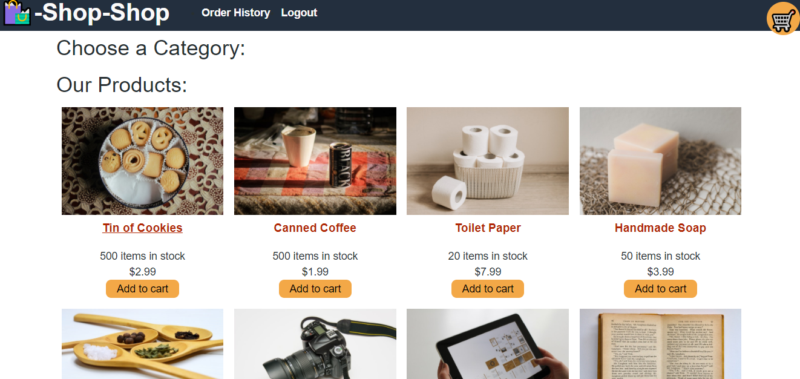
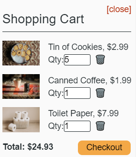
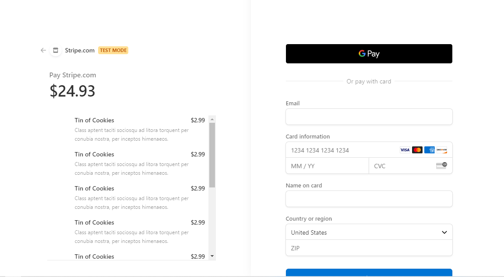

This project was bootstrapped with [Create React App](https://github.com/facebook/create-react-app).

<h1 align="center">Shop Shop</h1>

  

## Table of Contents
- [Description](#description)
- [Installation](#install)
- [Usage](#usage)
- [Questions](#questions)

## Description
### This application uses React, SCSS, Node, JS, CSS, HTML, MONGO, and State managment to allow users to add delete and update items to a virtual cart and checkout. 

## screenshots

## Usage
The page will run with an NPM start command at the root of the file tree.

## Install
If you want a working version on local

npm install create-react-app  --> this was created in that framework

npm start

npm install nodemon "if you want an easier time"

## Questions
## Contact me at:
### [JCSRyan](https://github.com/jcsryan)
### JohnConnorSRyan@gmail.com